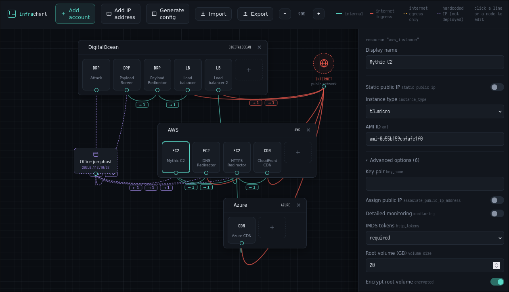
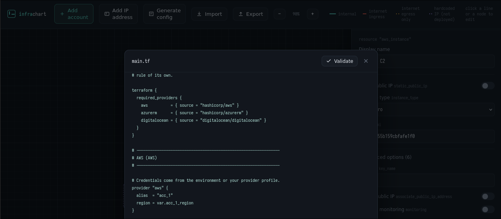

# InfraGen

> [!CAUTION] 
> This is a prototype application and is mostly vibe-coded and filled with bugs. 

## About

Infragen is a web-application that allows users to build Cloud infrastructure using drag-and-drop nodes and flow chart connections. The output of an infrastructure map can then be used to generate Terraform/OpenTofu for deployment into live environments. This was originally developed as a visual aid for red-team infrastructure, and will be catered towards that.

## Design Considerations

This application is written primarily in Go, using templ as a front-end templating engine. Nodes use a generic template, and the content is derived from the resource models listed in /catalog. This has been developed around modularity, allowing additional resources to be supported with minimal refactoring. 

> [!IMPORTANT] 
> This is currently not the case with the FlowChart -> Tofu logic, which contains a lot of case logic for different providers. This is on the to-do list.

The use of models also allows easy import/export to JSON files, with templ handling input sanitisation.

## How to

```
go tool templ generate && go run . -seed
```

`go tool templ generate` will generate the go source from the .templ template files.
`-seed` is used to provide a generic base infrastructure, but can be omitted to start with a blank canvas.

The application defaults to localhost:8080

## Screenshot





## Feature Roadmap

- [ ] Add configuration options to support either init-scripts or integrations with Ansible
- [ ] Add DNS support, integrating with popular Registrars (this will include automated checks for health and reputation)
- [ ] Add the option to apply the OpenTofu plan and detect configuration drift. This will help with quick teardown/restoration of burnt assets
- [ ] Clean up /internal/tofu/firewall.go to make it easier to add other providers
- [ ] Refactor the slop out

